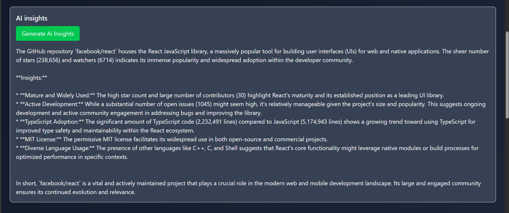
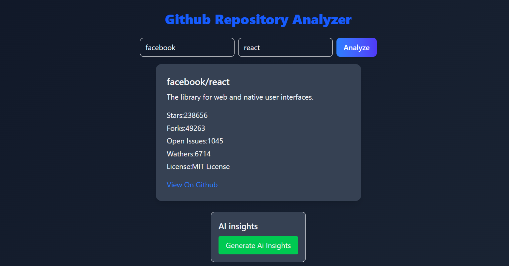
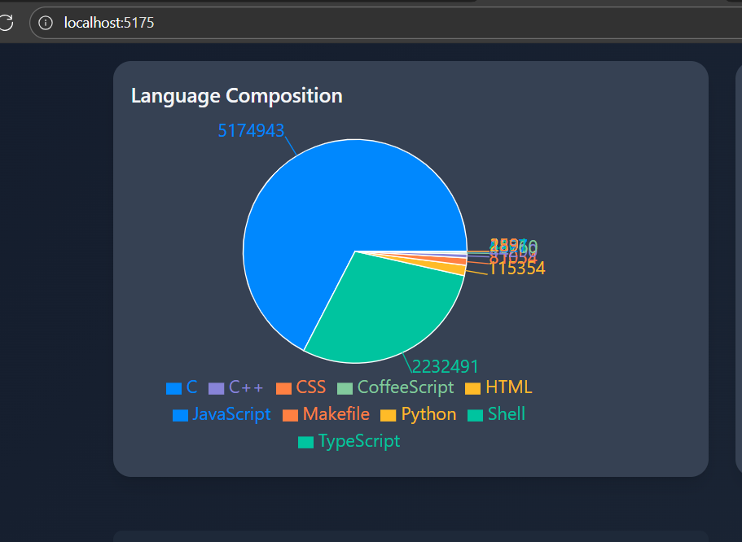
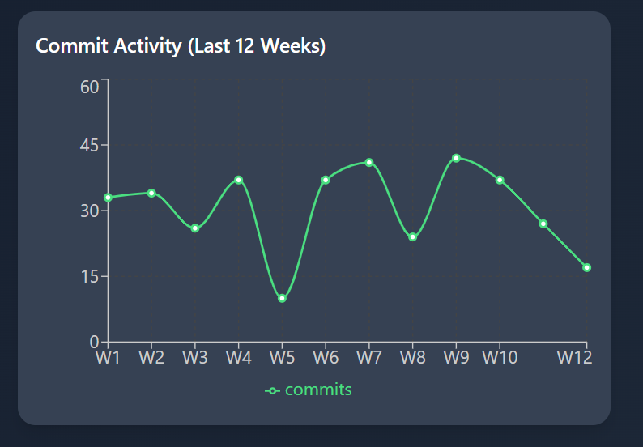
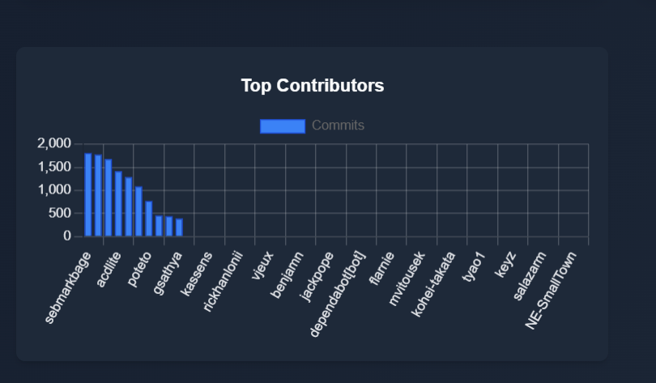

#Github Repository Analyzer

**Switch Between light and dark themes for better readability**

------


 A web app that analyzes any public Github repository and visualizes:
 - **Commit activity** (last 12 weeks)
 - **Top contributors**
 - **Language used**

 Built with **React**,**vite**,**TilwindCss**,**Recharts/Chart.js**,and the **Github REST API**.
 ---
 ## Feathers:
 -Commit Activity (12 weeks) line charts
 -Top Contributors bar chart with theier Github Avatars and direct profile links
 -Language Used dobut/pie chart
 -Clean dark UI,responsive layout
 -Error handling (invalid repo,network issue)
 -PWA setup(basic offline page)

 ---

 ## Tech Stack

 -**Fronted:** React +Vite
 -**Styling:**TailwindCss
 -**Charts:**Recharts(and/or Chart.js)
 -**API:** Github REST API
 -**PWA:** vite-plugin-pwa

 ---

 ##Setup & Run

 ```bash
 # 1.Clone
 git clone https://github.com/<Github-Username>/<Repository-name>.git
 cd<Repository-name>


 # 2 Install deps
 npm install

 # 3 (optional) Github token for higher rate limits
 # Create .env in the project root with:
 #VITE_GITHUB_TOKEN=ghp_xxx_your_token_here


 # 4 Start dev server
 npm run dev
 # 5 Start the backend server
  node zerver.js
  ---
   #search repository
  ! [search](public/screenshot/search.png)
  #AI Insights
  
  #Repository data
  
  #Languages Chart
  
  #Commit Chart
  
  #Contributors
  

